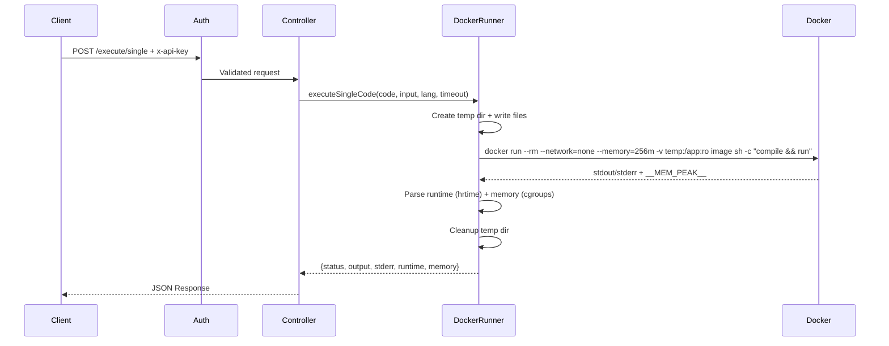
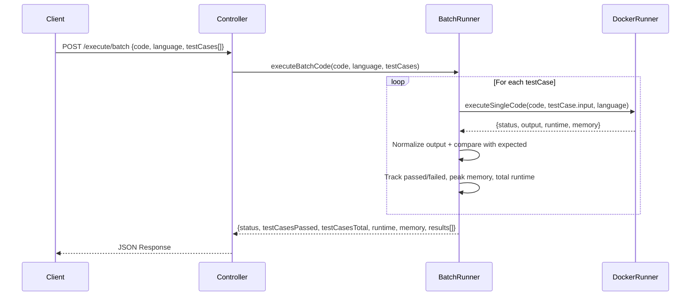
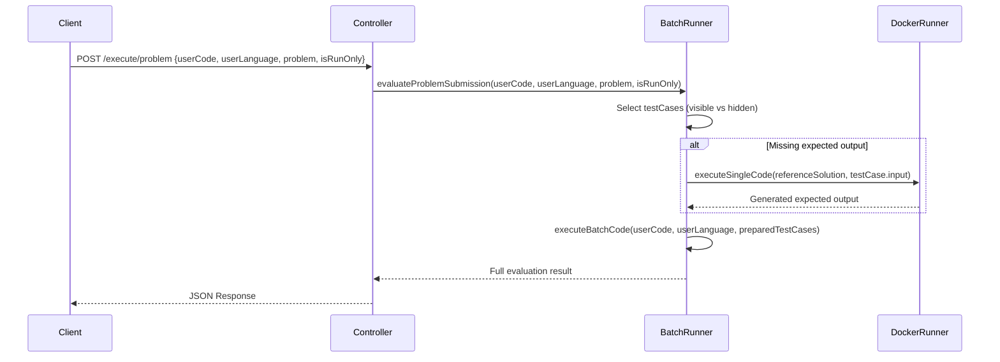
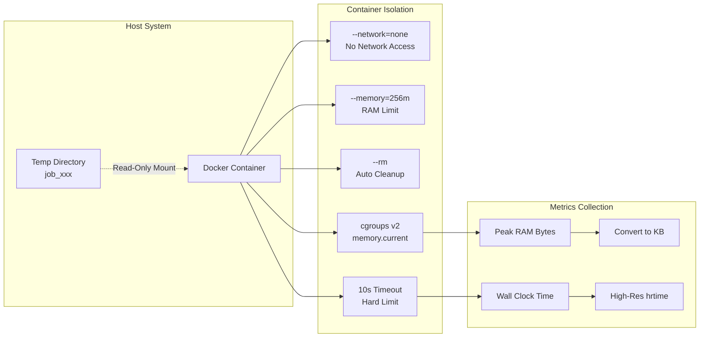

# Custom Compiler Microservice - Workflow Diagram

> **🎬 High-Quality Animated Architecture Visualization**
>
> **View Options:**
> - **Interactive HTML:** [Open `docs/sandbox-workflow.html`](docs/sandbox-workflow.html) — Full-screen animated diagram with legend
> - **Raw SVG:** [Open `docs/sandbox-workflow.svg`](docs/sandbox-workflow.svg) — Embeddable animated SVG
> - **GitHub Raw:** `https://raw.githubusercontent.com/<user>/<repo>/main/docs/sandbox-workflow.svg` (replace with your repo URL)
>
> The visualization features: dark futuristic dashboard aesthetic, glowing component cards, animated data packets flowing along curved paths, pulsing status indicators, security boundary visualization, and a complete request→response lifecycle animation.



---

> **Note:** GitHub markdown may not render SVG animations. For the full animated experience, open the HTML file or the raw SVG URL directly in a browser.

## System Architecture

```mermaid
graph TB
    subgraph "Client Layer"
        A[CodeNexus Main Backend<br/>Port 4000] -->|HTTP POST /execute<br/>x-api-key header| B[Custom Compiler<br/>Port 5001]
    end

    subgraph "Custom Compiler Microservice"
        B --> C{Auth Middleware}
        C -->|Valid API Key| D[Express Router]
        C -->|Invalid API Key| E[401 Unauthorized]
        D --> F[/health]
        D --> G[/execute/single]
        D --> H[/execute/batch]
        D --> I[/execute/problem]
    end

    subgraph "Execution Services"
        G --> J[executeSingleCode]
        H --> K[executeBatchCode]
        I --> L[evaluateProblemSubmission]
        L --> K
        K --> J
    end

    subgraph "Docker Sandbox Execution"
        J --> M[Create Temp Directory<br/>job_{timestamp}_{random}]
        M --> N[Write code + input files]
        N --> O[Docker Run Command]
        O --> P[Isolated Container<br/>--network=none<br/>--memory=256m<br/>-v temp:/app:ro<br/>--rm]
        P --> Q[Execute Code]
        Q --> R[Parse Output + Metrics]
        R --> S[Cleanup Temp Dir]
        S --> T[Return Result]
    end
```

## Single Execution Flow (`/execute/single`)

> **Animated view:** See the "Client → Auth → Router → executeSingleCode → Docker Pipeline → Return" flow in the [SVG animation](workflow-animation.svg) (top-left to right sections).



## Batch Execution Flow (`/execute/batch`)

> **Animated view:** See the "Router → executeBatchCode ⟲ executeSingleCode (loop) → Aggregate Results" flow in the [SVG animation](workflow-animation.svg) (center service nodes with looping arrows).



## Problem Evaluation Flow (`/execute/problem`)

> **Animated view:** See the "Router → evaluateProblemSubmission → (ref solution?) → executeBatchCode" flow in the [SVG animation](workflow-animation.svg) (rightmost service node connecting to batch).



## Docker Sandbox Security Model

> **Animated view:** See the three-panel security model (Host System → Container Isolation → Metrics Collection) in the [SVG animation](workflow-animation.svg) (bottom section with pulsing checkmarks).



## API Response Formats

> **Animated view:** Live JSON response examples rendered in the [SVG animation](workflow-animation.svg) (bottom-right corner with syntax highlighting).

### Single Execution Response
```json
{
  "status": "success|error|tle",
  "output": "program stdout",
  "stderr": "compilation/runtime errors",
  "runtime": 0.001,
  "memory": 1024
}
```

### Batch/Problem Response
```json
{
  "status": "accepted|wrong|error|tle",
  "testCasesPassed": 3,
  "testCasesTotal": 5,
  "runtime": 0.045,
  "memory": 2048,
  "errorMessage": "Wrong Answer on Test Case #4...",
  "results": [
    {
      "testCaseNumber": 1,
      "status": "passed",
      "status_id": 3,
      "input": "5 3",
      "actualOutput": "8",
      "expectedOutput": "8",
      "runtime": 0.009,
      "memory": 1024
    }
  ]
}
```